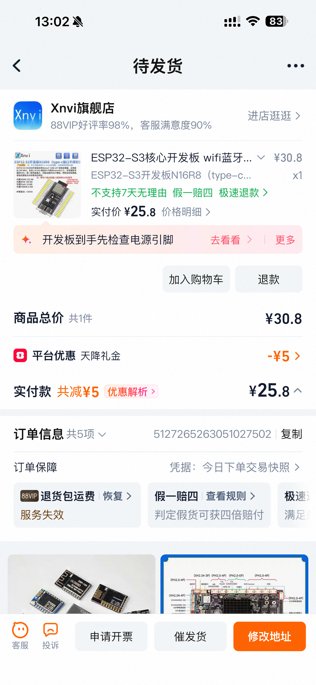
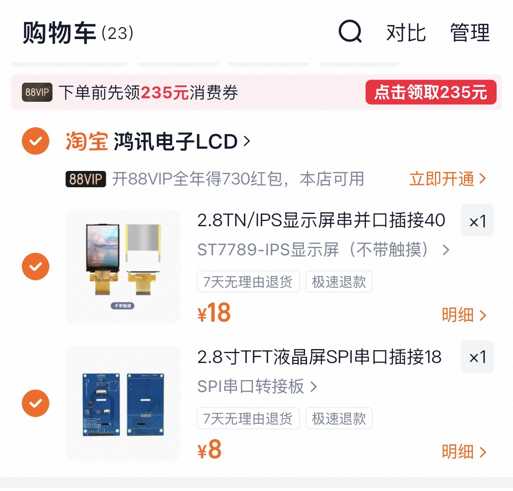
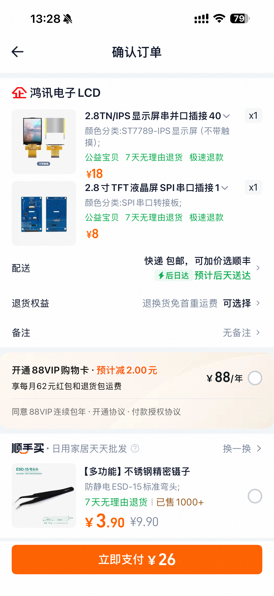

# 开发板验证材料购买清单

这里记录 Status Deck 在开发板验证阶段需要购买的模块、耗材和工具。

这个清单用于早期原型验证，不代表最终 PCB 版本的 BOM。模块型号、价格和购买链接会随着测试结果调整。

## 购买原则

- 优先选择常见、容易买到、资料完整的模块
- 优先选择 3.3V 逻辑电平兼容 ESP32 的模块
- 同类模块至少记录一个可替代型号
- 购买前确认接口、排针方向、尺寸和供电电压
- 截图保留商品标题、型号、关键参数和价格，方便后续复购或替换

### ESP32 开发板

选用 `ESP32-S3 N16R8` 开发板，作为当前开发板验证阶段的主控模块。

| 项目 | 内容 |
| --- | --- |
| 型号 | ESP32-S3 N16R8 |
| 接口 | Type-C |
| 排针 | 不焊针 |
| 数量 | 1 |
| 成本 | 25.8 元 |
| 用途 | BLE 通信、屏幕驱动和状态数据展示 |

商品截图：

  
  

选择原因：

- ESP32-S3 支持 BLE，适合作为桌面客户端与状态卡之间的通信主控
- N16R8 规格预留空间更充足，方便后续尝试更复杂的界面和缓存数据
- Type-C 接口更适合日常调试、供电和固件烧录
- 不焊针版本方便后续根据外壳、面包板或 PCB 转接方式决定排针方向

购买注意：

- 确认商品标题或规格中包含 `N16R8`
- 确认接口是 Type-C
- 确认下单选项是不焊针版本
- 收到后先测试串口识别、烧录和 BLE 基础功能

### 显示屏模块
 
截图：

  
  

购买要点：

- 确认驱动芯片
- 确认分辨率
- 确认通信接口
- 确认供电电压和逻辑电平
- 确认屏幕尺寸和排针方向

## 到货检查

| 模块 | 检查项 | 结果 | 备注 |
| --- | --- | --- | --- |
| ESP32 开发板 | 能否正常上电、识别串口、烧录固件 | 待测试 | 待补充 |
| 显示屏模块 | 能否点亮、颜色/刷新是否正常 | 待测试 | 待补充 |
| 按键/旋钮 | 输入是否稳定、是否需要上拉/下拉 | 待测试 | 待补充 |
| 杜邦线/面包板 | 接触是否稳定 | 待测试 | 待补充 |

## 价格记录

| 日期 | 项目 | 店铺/渠道 | 单价 | 数量 | 运费 | 合计 | 备注 |
| --- | --- | --- | --- | --- | --- | --- | --- |
| 待定 | 待定 | 待定 | 待定 | 待定 | 待定 | 待定 | 待定 |
